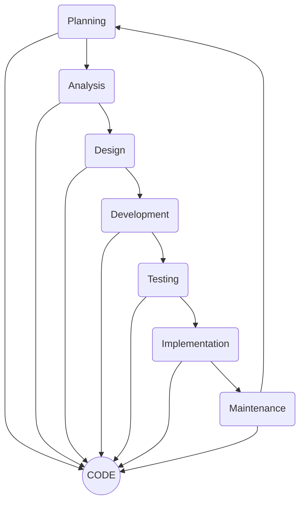
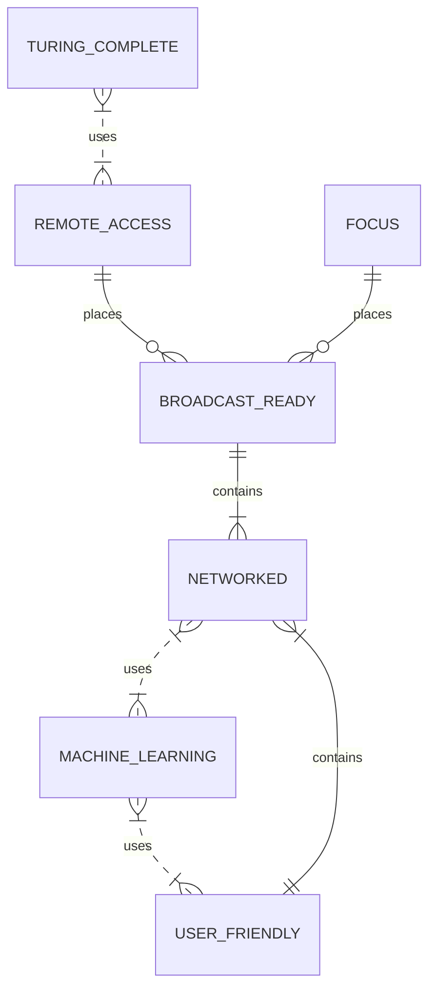

# Resume of Alex McCombie : Coder

| - | - |
| ---- | ----|
| email | alex.mccombie@lspacelabs.com |
| mobile | 0410 421 362 |
| region | Maitland, Newcastle, NSW, Australia |
| available | 19/2/2022 |

- Features:
	- **Remotely accessible** - I work better remotely. The proof is in the code I post.
		- **Broadcast Ready** - I care about growing userbases.  The more the merrier!
	- **Networked and Connected** :  I know exactly how online my system are, and upgrade them to hit 100% uptime.
		- **Noise reduction** : I am able to filter noisy real world data and focus on what is important.
	- **Machine Learning** : My machines acquire data and configurations, and just get smarter over time.
		- **User friendly** - I am willing to bug people in IT - if required - to deliver seamless user experiences.
	- **Turing tested** - In an environment of video meetings, I can almost always pass as a human.

- Tried and Tested
	- I’ve written so much code.  If someone explains some new data or answer they need, my mind immediately starts devising a digital creation to solve the problem, and how I can best explain this to the next computer I meet.  It doesn't take much to get me coding.
 	- I am really easy-going about everything _except_ software.  I want to be able to create useful applications for millions of people - I want it to work first time every time - I want it to be simple and beautiful.   I am a futurist - I want technology to live up to its promise of becoming indistinguishable from magic - which will require beautifully designed software.

- Remotely Accessible
	- Some people have difficulties with remote work.   Not me - that's where I do my best work.
	- I like meetings that involve a lot of screen sharing of working prototypes and solutions.
	- I am up for online pair programming or competitive code sprints.   

- Fast startup
	- Give me my login details, and I am ready to code.
	- I will create multiple prototypes to spark further design discussions.
	- I can thrive in any role where I am judged by my code. 
	- I already have my own sweet development rig.

- Mission oriented
	- Solving human problems is the purpose of all business and technology.  
		- Sustainable businesses grow by solving a problem, and adding to collective human happiness.   
	- I love innovation, and innovative industries - renewable energy, machine learning,  graphics and VR, gaming are all fields I can really throw myself at.  I always aim to over-perform - but only in an ethical industry that the world really needs.   

- Tuned in
	- Software is more than the code itself - it’s a delicate web of implied connections created by the shape of the code.   
		- You need to be able to see it to change it.   Visualising software takes focused practice, and the right tunes.  
- 	- Remote work means I get to choose my soundtrack.  
		- I have specific tracks (links below) I use to promote a coding state of mind so I can see the connections.   This is a tried and tested soundtrack of a lot of highly creative coding marathons over the years. 
	
- High performance
	- Coding in the cloud age has become a performance art.
		- As a coder, I am always aware of my audience.   They are going to experience my work, and the aim is to code something they will love.   
	- Large audiences with urgent problems are a great motivator.   Sometimes the solution just a short code sprint away.   
		- Wherever possible, I will collapse deadlines with a 10x result using a shortcut no-one else saw.

- User friendly
	- I also understand that most people don’t really give a flying _fig_ about software.   They just want the software to work so they can get on with their day.   I  build software that does the job and gets out of the way.
		- I speak fluent computerese as a second language, though I prefer to speak english around humans.
	- I don’t want to fill this resume with a list of every tech that has been released in the last 30 years.  You can safely assume I’ve probably worked with it, and I am always interested in conquering another. 
	- The most magical feature of software is not in the details - it is hiding the details and making life simpler for real people.

---

> - Coding soundtrack
> 	- Coding sprints - epicuros: [https://www.youtube.com/watch?v=vSzCv4gozm8]
> 	- Design deep dives - Stellardrone: [https://www.youtube.com/watch?v=_398X4JxakA]


---

## Change History
- My father was a programmer for IBM.  He would bring home some of the latest tech for me to play with - including some of the first IBM PCs in the country.   
	- I was fascinated with the idea that I could tell a computer to do something and it would *have to do it*.     When I couldn’t be at my computer, I was designing software on the back pages of school notepads for when I could get back to the keyboard.   
- I'll write code for any platform I can get my hands on - C++,  assembly code, node, mobile phones, PLC's, kiosks, arduino, VR headsets, containers, cloud, serverless - they are all software-controllable parts of the world.   
- Running my own SaaS operation and overseeing the whole process from start to finish has been an education - lots of freedom but also a lot of hats to wear.
	- I’ve used software to solve the real world problems of some big clients:  Origin Energy |  BHP | Brambles | Telstra | KPMG
- I love being part of a team of code creators, stealing techniques and flexing my skills with people who are good judges of software.

--- 

#### launchpad labs | 2007-2021 | Founder, Analyst Coder 
- stack: everything.    
- launchpad is a lab where I test out every significant new coding technology as it becomes available.
- All these technologies have been learned in production environments.
- Networked code -  javascript, node, npm, every stack you can imagine 
- Deployment– linux, docker, kubernetes, containers  
- Infrastructure – AWS, google cloud, azure, cloudflare 
- Databases - oracle, sql, mssql, postgres, mongodb  
- Cloud functions - serverless functions, pubsub, microservices  
- Comms-  Microsoft graph, google workspace, slack api  
- Web services – react.js, vue.js, angular, wordpress  
- Networking - socket.io, html5 live voice and video connections  
- Coding - vscode, CI/CD, github, stackoverflow 
- Analysis: graphql, microsoft BI, vizio 
- Controllers - C#, C++, arduino, python, php, APL, assembly  
- Graphics - WebGL, three.js, d3, babylonjs, A-frame, unity  
- Devices: PCs, cloud servers, mobile devices, VR applications, PLC’s, drone and robot controllers. 
- DevOps: 24/7 monitoring of network services. 

Clients: I-sec | CVEM | ATMAAC | SecurityWorx | IPS | Maxcorp | Phantom Security | 4M Security | Southern Cross Group 
- Independent provider of SaaS ERP, rostering and HR systems to the security industry 
- Innovative early adopter of dynamic web interfaces and live socket-connected clients. 
- Providing access to a wide range of security related administrative and staffing functions. 
	- automatic license checking, rostering, payroll 
	- automated two-way SMS staff comms 
	- automated creation of print-quality PDF invoices, timesheets, pay slips 
	- data analysis integrations with excel and MYOB 
	- license scans. photo ID, license renewal management  
	- KPI tracking, project management. 
- This system was solidly online 24/7 for 12 years.  
- Used by dozens of companies to calculate millions of dollars of wages for thousands of staff.  
- Provided logistics support for events such as the Big Day Out, the Grand Prix, Splendor in the Grass and Mardigras. 

 
 ---
 
#### Pioneera | Networked Sentiment Analysis | 2021-2022 | Analyst Coder
- Stack: Kubernetes, google cloud, AWS, azure, serverless functions, pub-sub endpoints, containerized microservices, feeding into a central node/react admin application. 
- Client: Pioneera is dedicated to monitoring staff communications with the aim of helping preventing staff stress  and turnover.   They source staff messaging from slack, Microsoft and google, and perform linguistic analysis of staff communications to guide companies in managing staff stress. 

- Pioneera’s system connect to a diverse population of microservices, pub-sub endpoint and serverless functions, that feed messaging data from their client companies, connecting to a growing population of slack, Microsoft and google messaging clients.   All CI/CD is managed through GitHub actions.   

- Deployed: Radar audit log 
	- Node/react/mongo/GCP stack that makes centralized debugging and logging simple across their entire codebase. 
	- I added infrastructure to allow the logging of system events, errors, debug and status reports from anywhere across a many-platformed codebase. 
	- Their application logs status messages from code running in google cloud, azure, slack API, with docker containers, pub-sub calls mapped and serverless functions. 
	- What was previously streamed to many different consoles via console.log(), became a single web page showing recent system events newest-first.  
	- Each event carries a payload that shows the context of the code at the point of the original log call.   This data is hidden behind a more details field in the event overview - so you expand and hide the details of any particularly interesting event.     This will be a detailed and invaluable resource for anyone debugging or extending the code in the future. 
	
---
    
#### Howsafe | Kiosk OS | 2021
- Stack: linux, node, mongodb, aws, google cloud, arduino, html5 video, facial recognition, fingerprint sensors 
- Client: Howsafe is a WHS consultancy that works with industrial clients across Australia.  
	- I was brought in to rescue a gateway kiosk project that had been abandoned by its developer.   I was told it only needed “a bit of a fix” - after 18 months of development, what they really had was a stand-alone prototype running on electron with no actual network connectivity. 
	- I studied the prototype and consulted with previous developers - and I re-implemented it in node, mongodb and reactjs.    After a week I had a look-alike web prototype of the new kiosk available.   This got discussion going about how the final product would work.   The online review team helped to test the concept interface, and develop the final application. 
	- Each kiosk has a 42-inch industrial touchscreen powered by an embedded Intel NUC, running a custom local server.    It acts as a sensor platform that hosts a video camera, a thermal sensor, a blood-alcohol tester, fingerprint reader, a sticker printer and a QR code scanner.  The software platform combines them all into a multi-factor site access point that feeds data back into the AWS backend logging system.     
- I really enjoyed building physical devices.   I’d be interested in doing more work that ties together sensor platforms, robotics and IOT. 

--- 

#### Telstra | Coder Analyst | 2003-2006
> - stack: IIS, perl, SQL, javascript
> - client: Telstra forms backbone of Australia's internet.   I was contracted to Telstra via KPMG.
> - I took a complex national excel-based AWA incentive payroll system, and turned it into a nationally accessible IIS resource. 
> - Achieved doubling of job clearance rates for a national workforce of 3300+ technicians.
> - Proved that incentive wages successfully motivate increased productivity and throughput.

---

#### Australian Wine Selectors | Coder Analyst | 2002-2003
> 	- IIS, perl, SQL, javascript
> - web design and administration
> - high quality web content ported directly from AWS magazine publishers.
> - online subscription and events management systems
> - call centre CRM  systems.

---

#### Aljan Internet | Operations Manager, Sysadmin | 2001-2002
> 	- unix, perl, cisco routers, SQL, apache
> - Rescue administrator of an overloaded failing ISP.   I organised staff acquisition and a technical rebuild of the service, and coded the custom quality control and monitoring software.

---

#### Northpower | Origin Energy | Coder Analyst  | 1997-2000
> 	- SQL, pascal, C++, Delphi, Oracle, unix
> - Northpower was formed from the merger of nine large councils and their electricity infrastructure into a single energy company covering most of regional NSW. I was assigned to the stores project, and then promoted to manage, conversion of the stores / material management system from a vt-100 terminal system into a modern GUI.
> - The project had stalled, as the vendor’s GUI system proved incapable of managing concurrent transactions. Each council had its own stores systems of thousands of stock items that needed to be rationalised into a single companywide system. Stores depots were often in remote locations operating over unreliable ADSL copper, and the chosen platform struggled even on a LAN connection. Staff were becoming sceptical that a working system was even possible.
> - I developed a radically simpler database client that did not require record locking -  it was robust enough to work at remote store locations over intermittent network connections.   This client/server model became the standard client model for other teams, and the overall conversion resulted in a system that turned nine electricity providers into one statewide provider.

---

#### Hastings Council | Data Analyst / Coder | 1996-1997
> pascal, Delphi, DEC unix, SQL
> - Created financial modelling tools for pricing wholesale electricity, and visualising trends and modelling different pricing scenarios. From here I was transferred to the conversion of a vt-100 minicomputer system, being given responsibility for their stores and material logistics system.

#### QRT | Business Analyst / Coder | 1994-1995 |
> APL, just-in-time logistics, pascal, SQL
> - Worked with clients such as BHP, GMH and Ford to optimise supply logistics for complex just-in-time production chains.

#### Brambles Industrial Services | Business Analyst / Coder | 1992-1993 |
> Borland pascal, visual basic, SQL
> - Created a rostering / activity tracking / payroll system for the transport division.
> - I converted a complex union-mandated paper system of distributing overtime work that required three administrative staff to manage, into a real-time rostering system that could be managed by a single staff member.


---

## References

> - Larry Clayton - CEO, SecurityWorx
> 	- launchpad client, 2011 to 2020
> 	- [larry@securityworx.com.au](mailto:larry@securityworx.com.au)
> 	- 0412 434 554

> - Mark Howe - CEO, Howsafe PLC
> 	- launchpad client, 2021
> 	- [mark@howsafe.com.au](mailto:mark@howsafe.com.au)
> 	- 0418 465 118

> - Tony Daou - CEO, ISec
> 	- launchpad client, 2008 to 2018
> 	- [tony.daou@isec.com.au](mailto:tony.daou@isec.com.au)
> 	- 0410 610 691

> - Jack Greenrich - Technical Lead, Resources Division, University of Newcastle
> 	- Colleague, fellow UON student and friend of long standing.
> 	- [jack.greenrich@newcastle.edu.au](mailto:jack.greenrich@newcastle.edu.au)
> 	- (02) 4921 6462

> - Rob Lavell - CIO, Australian Wine Selectors
> 	- Managed the delivery of a print-quality website, and CRM services.
> 	- (02) 4946 9242


---

# Appendix: Writeable and Readable Coding Styles

This was a top-rated solution to a problem on codewars.com:

```javascript
function DUPLICATE_COUNT(text){return [...new Set([...text.toLowerCase()].sort().filter((c,p,a)=>c===a[p-1]))].length}
```

Clever code tricks like this allow you to write powerful one-liners.
They are so clever they basically defy understanding.   I avoid them.
I would refer this as “write-only” code - even if you can write it, no-one else will be able to read it.  
Hint - its "a function that counts duplicate characters in a string."   

My preferred solution would be more like:
```javascript
function DUPLICATE_COUNT(text){
// Return the number of repeated characters in the input string
	let CharCounts={};
	for(let a=0;a<text.length;a++){
		let TheChar=text[a].toUpperCase();
		if(!(TheChar in CharCounts)){ CharCounts[TheChar]=0 };
		CharCounts[TheChar]++;
	};
	let CharCountsKeys=Object.keys(CharCounts);
	let DuplicateCount=0;
	for(let a=0;a<CharCountsKeys.length;a++){
		if(CharCounts[CharCountsKeys[a]]>1){ DuplicateCount++ };
	}
	return(DuplicateCount);
}
```
- Production code gets written once, but will need to be read many times.   Meaningful variable names allow the function to read like a flowchart.
- My version actually runs a bit faster too, because it's simple and optimises well.


---

### Appendix: VR Coding Experiments.

Here’s a collection of VR prototypes I have built as experiments, just to see what the technology allows.  This is not unreal or unity or steam - these interactive 3D spaces are built in webGL - they are just webpages running in chrome.   Webpages?! More like "Interactive GPU powered 3D metaverse VR spaces with true load-on-demand" !    100% built from my raw code, and three.js.

>Multimedia Arts Space - Freely explore a virtual art gallery, with thousands of paintings, music, streamed video and interactive exhibits.
> [https://www.youtube.com/watch?v=lN641qD_KMA](https://www.youtube.com/watch?v=lN641qD_KMA)
  
>Online Learning Space - A virtual museum of VR that presents photos, video, text and interactive 3D models into a single interactive space.
[https://www.youtube.com/watch?v=2zxw7tZmAVY](https://www.youtube.com/watch?v=2zxw7tZmAVY)

>VR Hearted Demos showcase - A platform that magically melds multiple interactive 3D sub-spaces into a single larger space. The content of each sub-space remains fully interactive as an object in the space. The content is not pre-compiled - you can freely extend the space with more sub-spaces without leaving the space.
[https://www.youtube.com/watch?v=1d68r3Y_118](https://www.youtube.com/watch?v=1d68r3Y_118)

>VR Physics Sandbox: Spacepool - the classic physics game taken into a new dimension. Complete physics demo, calculating the positions, velocity, acceleration and impulse of hundreds of objects at 60fps.
[https://www.youtube.com/watch?v=PdwJqs6uPOg](https://www.youtube.com/watch?v=PdwJqs6uPOg)

>VR Physics Sandbox: Planetoids - defend a base against inbound bouncing space rocks. A VR shooter with all the ballistic precision of pool and the pace of a sport.
[https://www.youtube.com/watch?v=v59SSv8HeFs](https://www.youtube.com/watch?v=v59SSv8HeFs)

This is just visual proof I can code.   I also do robust lightning quick vanilla databases, including all the database infrastructure behind these demos.   If your mission involves computation, I am confident I can contribute.


---






